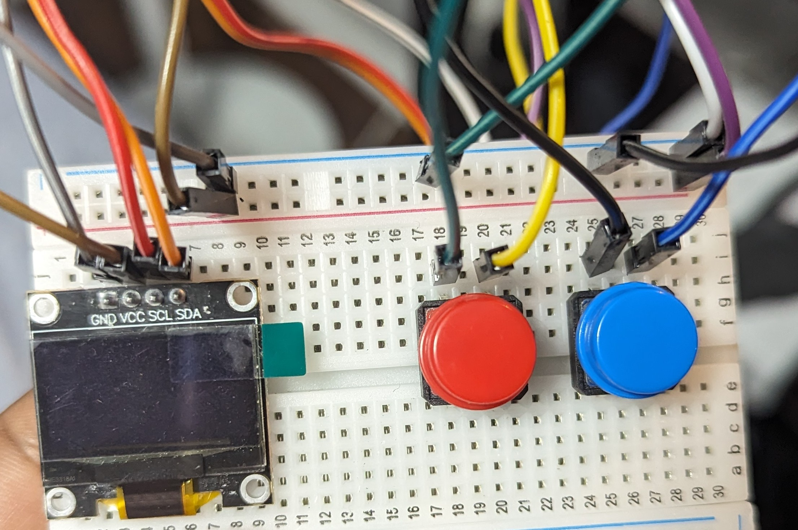
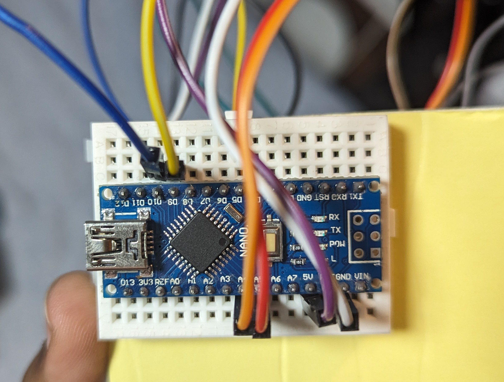

# OLED Game Console

This is a simple game console created to run on a 128x64 OLED screen. There are three games, Snake, Dino Run, and Pong.

## Goal

The goal of this project was to introduce me to the basics of creating circuits, as well as the basics and syntax of C++.

## Images

(Sped up GIF)

## Materials

- Arduino Nano
- 128x64 White OLED Display
- x2 Push Buttons
- Breadboard, Jumper Cables, Resistors
